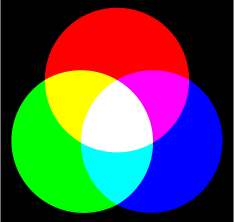
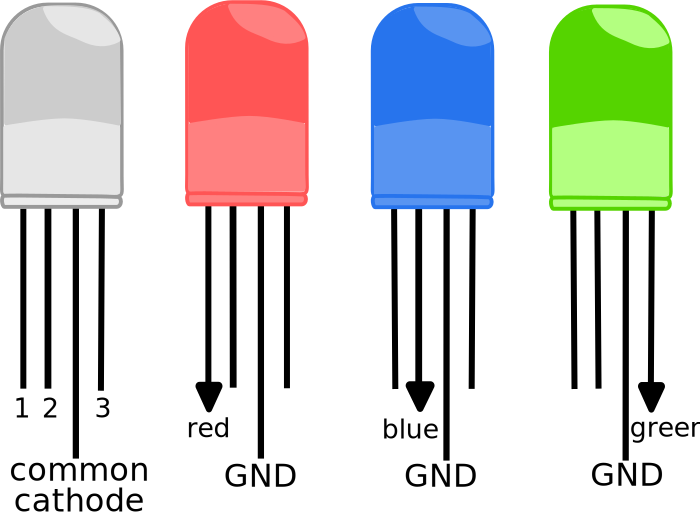
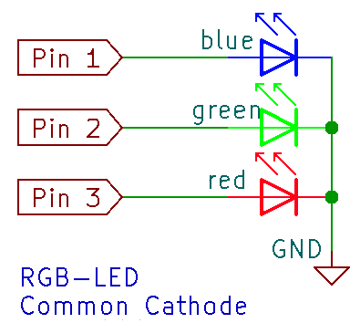
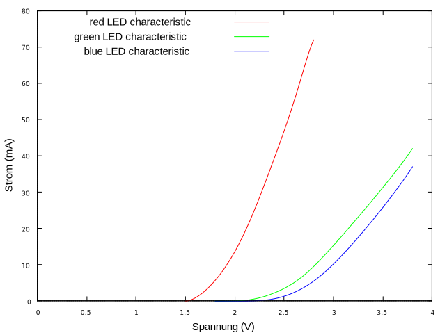

*„Das Gesicht des Menschen erkennst du bei Licht, seinen Charakter im Dunkeln.“ - Verfasser unbekannt*

# RGB Multi Color LED Control

This is a clearly arranged Arduino library used to easily drive a RGB color LED (common anode/common cathode) and mix the colors.
It uses the principle of [additive color mixing](https://en.wikipedia.org/wiki/Additive_color), resulting in the following 7 colors: red, green, blue, yellow, cyan, magenta and white.
As long as you use the Arduino definitions, it should not matter which microcontroller or board you use.

<p align="center">
  
</p>


If you drive only one pin of the RGB LED, you get the 3 basic colors. The other colours are obtained by mixing these basic colours.
<p align="center">
  
</p>

## Hardware Setup

An RGB LED combines 3 LEDs in one. Depending on your taste, they are available with a common anode or a common cathode.
Below you can see the internal circuit structure.
<p align="center">
  
</p>

It may make sense to choose the common anode if the current consumption of the components is higher, because then it is not the microcontroller that limits the current, but the voltage source to which the microcontroller is normally connected. (However, keep to the max pin current absorption of the microcontroller.) With a single RGB common cathode LED this should not be a problem. You should always keep an eye on the total current to be driven and the individual currents per port. As a rule, you should consider using series resistors for (light) diodes. I have drawn the characteristics of a RGB LED for you. Depending on which microcontroller you use, the red LED would not last long in your circuit at 3.3 volts without a resistor. Even more problematic are 5 Volt systems. My advice is to limit the current to 20 mA per LED (colour). Because the curves are so far apart, a common cathode/anode resistor is not advisable. If you fuse the red LED with 20mA, you will hardly see any light from the blue LED.

<p align="center">
  
</p>

## Usage
1. Copy the src directory into your current Arduino project directory. Alternatively, you can also move the „./MultiColorLedControl“ directory to your Arduino library directory. (~/Arduino/libraries/)
2. Include the header file using the include directive.
3. This library is organized in a class. First create an object.
4. Then call the setup method and specify the 3 hardware ports of the microcontroller to which the RGB LED is connected. As the last parameter, specify the LED type as COMMON_ANODE or COMMON_CATHODE.
5. Now you can use the LED. First run the TestLEDs() method that displays all colors individually to make sure everything is connected correctly to the microcontroller.


Here is an example as Common Cathode :

```C
#include "src/MultiColorLedControl/MultiColorLedControl.h"
MultiColorLedControl ledControl;

void setup() {
  // put your setup code here, to run once:
  ledControl.setupLEDs(11,10,9,COMMON_CATHODE);

}

void loop() {
  // put your main code here, to run repeatedly:
  ledControl.TestLEDs();
}
```

All other methods should be self-explanatory. Here are all the methods of the library:

## Library overview

```C
enum LedType //possible LED types
{
    COMMON_ANODE,   //common Vcc
    COMMON_CATHODE  //common ground
};

// Configures the outputs, sets the LED type and defines the hardware ports based on their connection
void setupLEDs(uint8_t blueLEDport, uint8_t greenLEDport, uint8_t redLEDport, LedType ledType);
// Raw function to mix the colors by yourself. true means LED on, independent of LED type
void setLEDColor(bool red, bool green, bool blue);
// Deactivates all LEDs, false means switch off, independent of LED type
void unsetLEDs(void);
// Activate only the red LED, independent of LED type
void setRedLED(bool state);
// Activate only the blue LED, independent of LED type
void setBlueLED(bool state);
// Activate only the green LED, independent of LED type
void setGreenLED(bool state);
// Activate only the yellow LED, independent of LED type
void setYellowLED(bool state);
// Activate only the cyan LED, independent of LED type
void setCyanLED(bool state);
// Activate only the magenta LED, independent of LED type
void setMagentaLED(bool state);
// Activate only the white LED, independent of LED type
void setWhiteLED(bool state);
// Test the LED functions in the Arduino loop() function
void TestLEDs(void);
```


## Thanks to:

- [Jana Weigel](https://janaweigel.wordpress.com/) for graphic design.

## Licence
This program by Michael Krause is licenced under the terms of the GPLv3.
