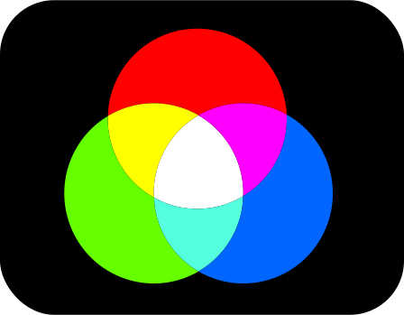
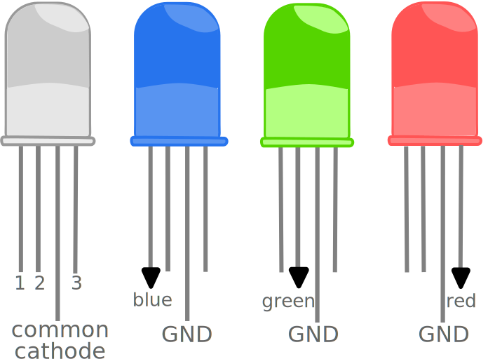
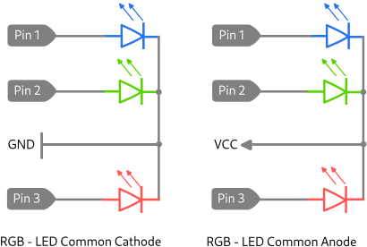

*„Das Gesicht des Menschen erkennst du bei Licht, seinen Charakter im Dunkeln.“ - Verfasser unbekannt*

# Basic Multi Color LED Control

This is a tiny and clearly arranged Arduino library for the basic RGB LED functions, to easily drive an RGB color LED (common anode/common cathode) and mix the colors.
It uses the principle of [additive color mixing](https://en.wikipedia.org/wiki/Additive_color), resulting in the following 7 colors: red, green, blue, yellow, cyan, magenta and white.
This concept relies on keeping the programme code small. The functionality should be expanded using the inheritance concept of object-oriented programming.

As long as you use the Arduino definitions, it should not matter which microcontroller or board you use.


<p align="center">
  
</p>


If you drive only one pin of the RGB LED, you get the 3 basic colors. The other colours are obtained by mixing these basic colours.
<p align="center">
  
</p>

## Hardware Setup

An RGB LED combines 3 LEDs in one. Depending on your taste, they are available with a common anode or a common cathode.
Below you can see the internal circuit structure.
<p align="center">
  
</p>

It may make sense to choose the common anode if the current consumption of the components is higher, because then it is not the microcontroller that limits the current, but the voltage source to which the microcontroller is normally connected. For beginners the common cathode is the better choice. Common cathode is more intuitive because when you get a high you also light the LED. With common anode it is the other way round. But leave this problem to this library. You should always keep an eye on the total current to be driven and the individual currents per port. As a rule, you should consider using series resistors for (light) diodes. I have drawn the characteristics of a RGB LED for you. Depending on which microcontroller you use, the red LED would not last long in your circuit at 3.3 volts without a resistor. Even more problematic are 5 Volt systems. My advice is to limit the current to 20 mA per LED (colour). Because the curves are so far apart, a common cathode/anode resistor is not advisable. If you fuse the red LED with 20mA in this way, you will get a rather weak light from the blue LED. Consider using an appropriate series resistor for each LED.

<p align="center">
  
</p>

If you don't feel like doing the math, here are some concrete recommendations:
For 3.3V, use about 68Ω for red.
For blue and green you can leave out the series resistor.
At 5V use for red: around 150Ω, for green around 100Ω and for blue also 100Ω.
Please note that there are qualitative differences in LEDs and my characteristics do not have to match your LEDs.

## Usage

Here is an example as Common Cathode :

```C
#include "src/BasicColorLedControl.h"
BasicColorLedControl RGBled;

void setup() {
  // put your setup code here, to run once:
  RGBled.setupLEDs(9,10,11,COMMON_CATHODE);

}

void loop() {
  // put your main code here, to run repeatedly:
  RGBled.TestLEDs();
}
```

All other methods should be self-explanatory. Here are all the methods of the library:

## Library overview

```C
enum LedColor //Basic RGB LED Colors
{
    RED,
    GREEN,
    BLUE,
    YELLOW,
    CYAN,
    MAGENTA,
    WHITE
};

enum LedType //possible LED types
{
    COMMON_ANODE,   //common Vcc
    COMMON_CATHODE  //common ground
};

// Configures the outputs, sets the LedType (COMMON_ANODE/COMMON_CATHODE), defines the hardware ports based on their connection
void setupLEDs(uint8_t redLEDport, uint8_t greenLEDport, uint8_t blueLEDport, LedType ledType);
//Raw function call to mix the LED colors by yourself. Good for efficient bit shifting operations
void setLEDColor(bool red, bool green, bool blue);
//Comfortable function call to set the LED color. You have the choice: RED,GREEN,BLUE,YELLOW,CYAN,MAGENTA,WHITE
void setLEDColor(LedColor color);
// Deactivates all LEDs
void unsetLEDs(void);
// Test the LED functions in the Arduino loop() function
void TestLEDs(void);
```


## Thanks to:

- [Jana Weigel](https://janaweigel.wordpress.com/) for graphic design.

## Licence
This program by Michael Krause is licenced under the terms of the GPLv3.
